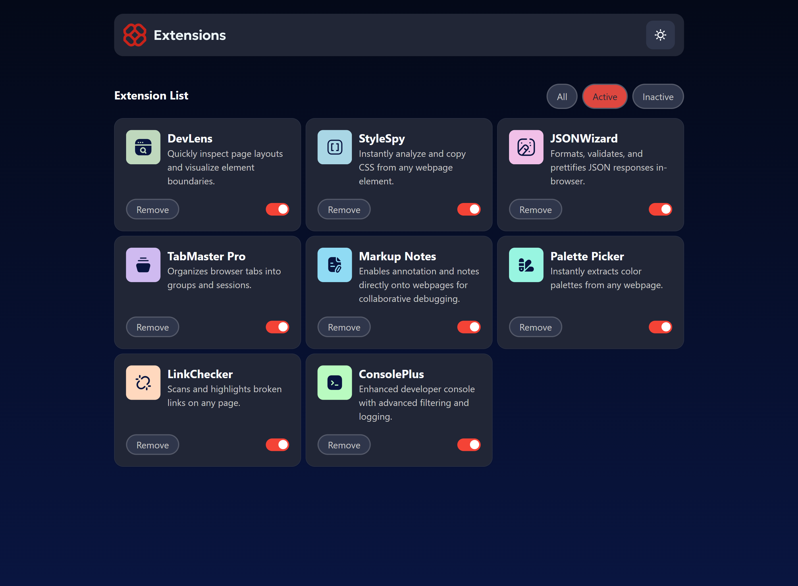
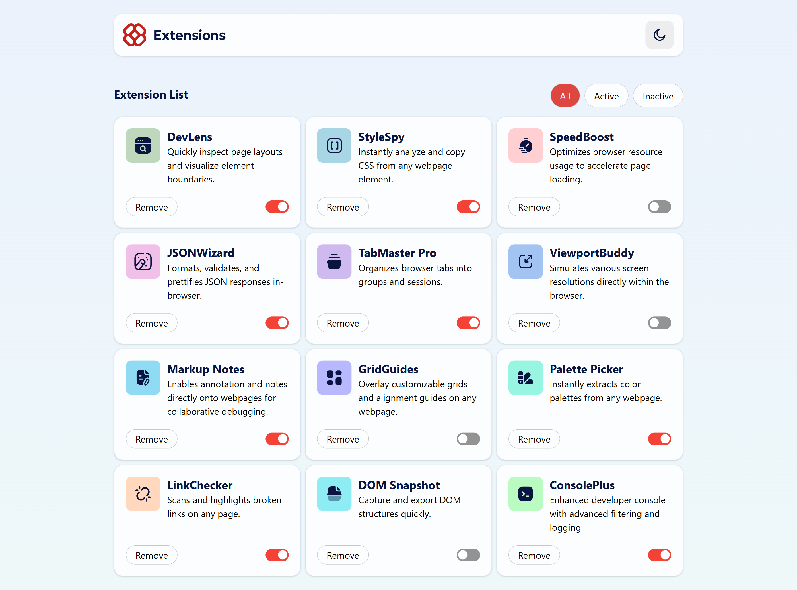
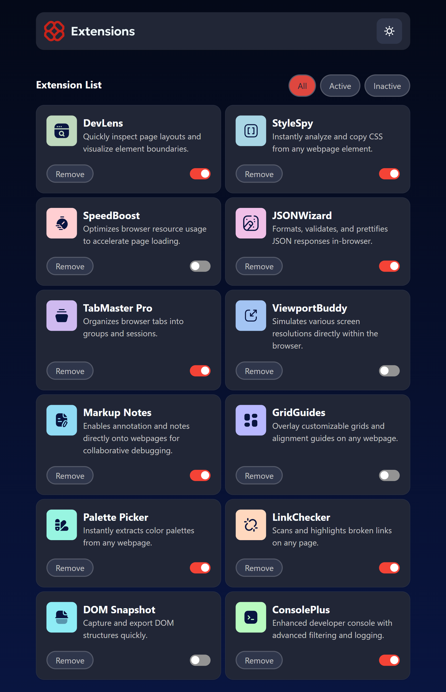
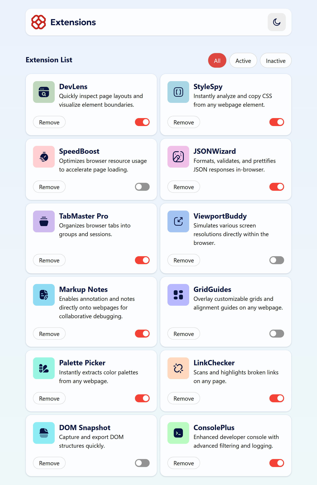
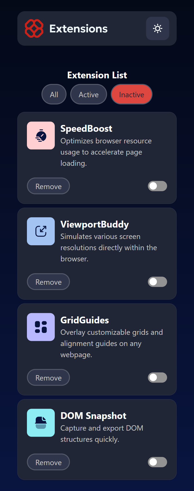
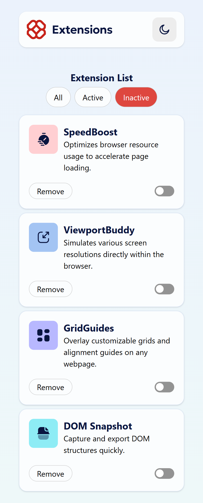

# Frontend Mentor - Browser extensions manager UI solution

Esta es una solución al reto de [Browser extensions manager UI](https://www.frontendmentor.io/challenges/browser-extension-manager-ui-yNZnOfsMAp) de Frontend Mentor. El proyecto consiste en una interfaz moderna para gestionar extensiones del navegador, con filtros, activación/desactivación y eliminación de elementos desde una experiencia visual clara y adaptable.

## Tabla de contenidos

- [Overview](#overview)
  - [The challenge](#the-challenge)
  - [Screenshot](#screenshot)
  - [Links](#links)
  - [My process](#my-process)
  - [Built with](#built-with)
  - [What I learned](#what-i-learned)
  - [Continued development](#continued-development)
  - [Useful resources](#useful-resources)
  - [AI Collaboration](#ai-collaboration)
- [Author](#author)
- [Acknowledgments](#acknowledgments)

## Overview

### The challenge

Los usuarios deben poder:

- Alternar entre estados activos e inactivos de las extensiones.
- Filtrar las extensiones por categoría.
- Eliminar extensiones de la lista.
- Cambiar el tema visual de la interfaz.
- Ver una disposición óptima según el tamaño de pantalla.
- Disfrutar de estados de hover y focus claros en los elementos interactivos.

### Screenshot

#### Vista escritorio

#### Vista tablet

#### Vista móvil

## My process

1. Se implementó un estado global con Context API para centralizar la lógica de filtros, activación y eliminación.
2. Se desarrollaron componentes reutilizables para la cabecera, filtros y tarjetas, manteniendo la UI modular.
3. Se aplicó un diseño responsive para que la experiencia sea consistente en escritorio, tablet y móvil.

## Built with

- Semantic HTML5 markup
- CSS custom properties
- Tailwindcss
- Mobile-first workflow
- React
- Vite
- ESLint

## What I learned

Este reto me permitió reforzar varios conceptos importantes:

- La importancia de separar datos y lógica para mantener el proyecto escalable.
- Cómo usar Context API para evitar prop drilling en aplicaciones pequeñas o medianas.
- La utilidad de memoizar operaciones costosas como el filtrado cuando cambia el estado.
- La necesidad de diseñar una interfaz que sea clara, accesible y adaptable a distintos tamaños de pantalla.

## Continued development

En futuras iteraciones se podría incorporar:

- Persistencia de datos en localStorage para recordar cambios entre recargas.
- Búsqueda y ordenación de extensiones.
- Pruebas unitarias e integración para asegurar el comportamiento de los componentes.
- Mejoras de accesibilidad y soporte para temas adicionales.

## Useful resources

- [Frontend Mentor](https://www.frontendmentor.io/)
- [Documentación de React](https://react.dev/)
- [Documentación de Vite](https://vitejs.dev/)
- [Guía de CSS Grid](https://css-tricks.com/snippets/css/complete-guide-grid/)

## AI Collaboration

Este proyecto también se apoyó en herramientas de asistencia con IA durante el desarrollo:

- Herramienta utilizada: GitHub Copilot.
- Uso principal: mejora de la documentación y ayuda en la resolución de problemas.

## Author

- Nombre: midasDev

## Acknowledgments

Agradecimientos a Frontend Mentor por proponer un reto tan práctico y a la comunidad de React y Vite por las referencias y recursos que facilitaron el desarrollo de esta solución.

